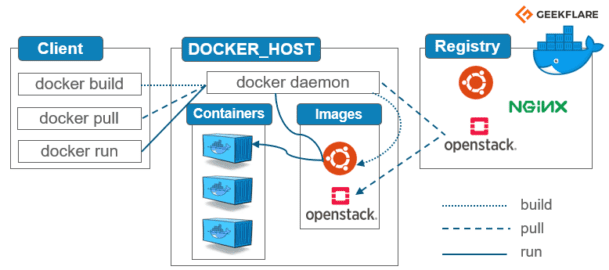

# What 
- Docker is a software platform that allows you to build, test, and deploy applications quickly. Docker packages software into standardized units called containers that have everything the software needs to run including libraries, system tools, code, and runtime.
## benefits 
- use less system resources
- good scalability 
- 
# Why
- Docker containers make it easy to put new versions of software, with new business features, into production quickly—and to quickly roll back to a previous version if you need to. They also make it easier to implement strategies like blue/green deployments.
# When
- You can use Docker to wrap up an application in such a way that its deployment and runtime issues—how to expose it on a network, how to manage its use of storage and memory and I/O, how to control access permissions—are handled outside of the application itself, and in a way that is consistent across all “containerized
# Who 
- some comaies that use docker are 
- Arkadin SAS
- Dailymotion SA
- California State University-Stanislaus
- NetSuite Inc
- Red Hat Inc
# Difference betweteen vertualisation and containerisation 
- Containerization is a form of virtualization. Virtualization aims to run multiple OS instances on a single server, whereas containerization runs a single OS instance, with multiple user spaces to isolate processes from one another
## virtualisation
- 
## Containerisation 

# commands to use when using docker 
```
Options:
      --config string      Location of client config files (default
                           "C:\\Users\\alexa\\.docker")
  -c, --context string     Name of the context to use to connect to the
                           daemon (overrides DOCKER_HOST env var and
                           default context set with "docker context use")
  -D, --debug              Enable debug mode
  -H, --host list          Daemon socket(s) to connect to
  -l, --log-level string   Set the logging level
                           ("debug"|"info"|"warn"|"error"|"fatal")
                           (default "info")
      --tls                Use TLS; implied by --tlsverify
      --tlscacert string   Trust certs signed only by this CA (default
                           "C:\\Users\\alexa\\.docker\\ca.pem")
      --tlscert string     Path to TLS certificate file (default
                           "C:\\Users\\alexa\\.docker\\cert.pem")
      --tlskey string      Path to TLS key file (default
                           "C:\\Users\\alexa\\.docker\\key.pem")
      --tlsverify          Use TLS and verify the remote
  -v, --version            Print version information and quit

Management Commands:
  builder     Manage builds
  buildx*     Docker Buildx (Docker Inc., v0.10.3)
  compose*    Docker Compose (Docker Inc., v2.15.1)
  config      Manage Docker configs
  container   Manage containers
  context     Manage contexts
  dev*        Docker Dev Environments (Docker Inc., v0.1.0)
  extension*  Manages Docker extensions (Docker Inc., v0.2.18)
  image       Manage images
  manifest    Manage Docker image manifests and manifest lists
  network     Manage networks
  node        Manage Swarm nodes
  plugin      Manage plugins
  sbom*       View the packaged-based Software Bill Of Materials (SBOM) for an image (Anchore Inc., 0.6.0)
  scan*       Docker Scan (Docker Inc., v0.25.0)
  scout*      Command line tool for Docker Scout (Docker Inc., v0.6.0)
  secret      Manage Docker secrets
  service     Manage services
  stack       Manage Docker stacks
  swarm       Manage Swarm
  system      Manage Docker
  trust       Manage trust on Docker images
  volume      Manage volumes

Commands:
  attach      Attach local standard input, output, and error streams to a running container
  build       Build an image from a Dockerfile
  commit      Create a new image from a container's changes
  cp          Copy files/folders between a container and the local filesystem
  create      Create a new container
  diff        Inspect changes to files or directories on a container's filesystem
  events      Get real time events from the server
  exec        Run a command in a running container
  export      Export a container's filesystem as a tar archive
  history     Show the history of an image
  images      List images
  import      Import the contents from a tarball to create a filesystem image
  info        Display system-wide information
  inspect     Return low-level information on Docker objects
  kill        Kill one or more running containers
  load        Load an image from a tar archive or STDIN
  login       Log in to a Docker registry
  logout      Log out from a Docker registry
  logs        Fetch the logs of a container
  pause       Pause all processes within one or more containers
  port        List port mappings or a specific mapping for the container
  ps          List containers
  pull        Pull an image or a repository from a registry
  push        Push an image or a repository to a registry
  rename      Rename a container
  restart     Restart one or more containers
  rm          Remove one or more containers
  rmi         Remove one or more images
  run         Run a command in a new container
  save        Save one or more images to a tar archive (streamed to STDOUT by default)
  search      Search the Docker Hub for images
  start       Start one or more stopped containers
  stats       Display a live stream of container(s) resource usage statistics
  stop        Stop one or more running containers
  tag         Create a tag TARGET_IMAGE that refers to SOURCE_IMAGE
  top         Display the running processes of a container
  unpause     Unpause all processes within one or more containers
  update      Update configuration of one or more containers
  version     Show the Docker version information
  wait        Block until one or more containers stop, then print their exit codes

Run 'docker COMMAND --help' for more information on a command.

To get more help with docker, check out our guides at https://docs.docker.com/go/guides/
```
# Docker Architecture


# Making changes to nginx 
- start by running this command `docker run -d -p 80:80 nginx` 
- to test that this works you just need to type in localhost into your browser and nginx should come up
```
docker exec -it <container id> /bin/bash # if this works good! if not try the following

docker exec -it <container id> sh

alias docker="winpty docker"

# run the command again 
docker exec -it <container id> sh
# now it should work
```

```
apt update -y
apt upgrade -y
apt install nano

cd /usr
cd share
cd nginx
cd html
ls
nano index.html
now in line <h1>welcome to devops </h1>
# change this to whatever you want and you should see the change when you re type in localhost.
```
# creating custon nginx template 
- creat a index.html with this line of code in it 
```
<html>
    <head>
        <title>Wellcome to Alex's website</title>
        <body>
        <h1>Wellcome to Alex's Website</h1>
        <h2> This website is hosted inside a container using docker to build a Micro-Service </h2>

    </body>


</head>


</html>
```
- then create a `Dockerfile` and add this code 
```
# select base image
FROM nginx

# copy data from localhost to the container 
copy index.html /usr/share/nginx/html/

# allow required ports
EXPOSE 98

# execute required commands
CMD ["nginx", "-g", "daemon off;"] 

``` 
run `docker build -t <docker hub name>/<image name> .` to build you service.

if sucessfull when running the command `docker push <repo name>/<name of image>` then you should see this 


to get the app working you need to write in this code 
```
FROM node:latest

# Now we have to set this directory as our working directory: 
WORKDIR /usr/src/app
 
# Copy the file package.json to the working directory with the following command:
COPY app /usr/src/app/
COPY package*.json ./
 
# After this we have to run npm install so that we can set up our node environment:
RUN npm install
 
# The app that I am running uses the port 3000, we will be using EXPOSE instruction so that it can be mapped by the docker daemon: 
EXPOSE 3000
 
# And then the final command to start our project with npm start:
CMD ["npm","start"]

```
then run the build run and push commands from before. 