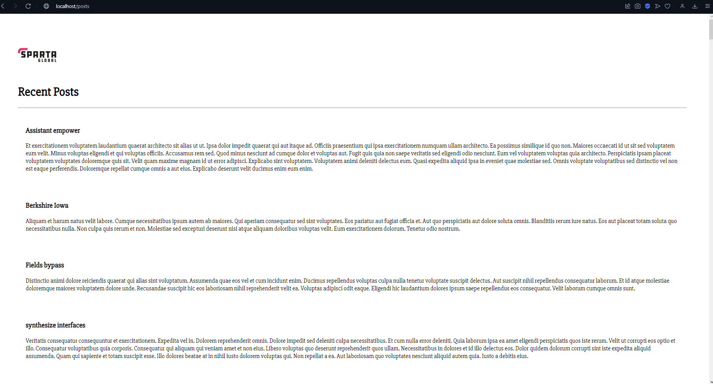

# running a db on docker compose 

## The code you will need to run to get this to work 
- youy will need to make an ew file called `docker-compose.yml`
- within this file run this code

```
version: "3"
services: 
  mongo:
    image: mongo:4.4
    container_name: mongo

    volumes:
     - ./app/mongod.conf:/etc/mongod.conf

    ports:
    - "27017:27017"
    


  app:
    container_name: app
    restart: always
    build: .
    ports:
      - "80:3000"
    links:
     - mongo
    environment:
    - DB_HOST=mongodb://mongo:27017/posts
    command: bash -c "node /usr/src/app/seeds/seed.js && cd /usr/src/app && npm start"
```

# getting the code to run
- to run this code you need to run the command `docker-compose up -d`
- if there is an error and you need to destory the file then you can run the command `docker-compose down` 
- if there are no erros then you will just need to run the this in the url `localhost/posts`
- you will get this page up 
