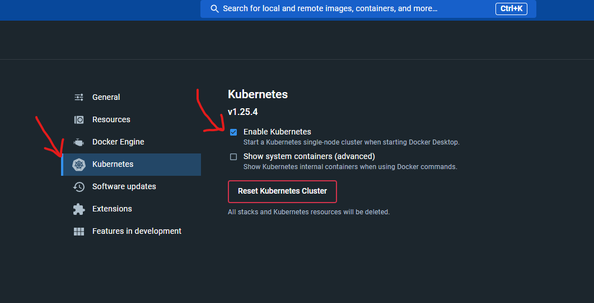
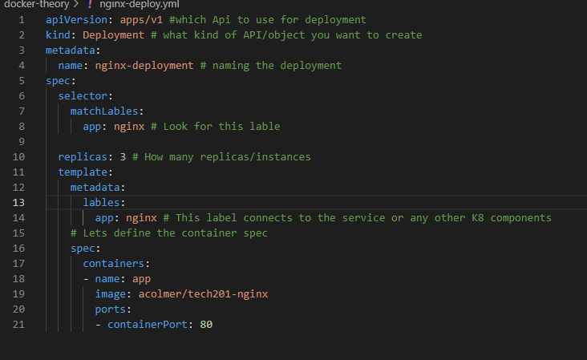

# What is kubernetes (K8)
- it is an open source system fir automating deployment, scaling and management of containerized applications. 

# Benefits of k8
- has multi cloud capabilities 
- automation of deployment and scalability 
- open source
- better stability 
- high avaliability 

# Kubernetes architecture 
## objects
- objects are persistant entities they use these entities to represent the state of your cluster 

# Difference bettwen signle and multi node clusters
## single node cluster 
- a single node cluster can be useful for development and testing environments, or for small scale deployments 
## multi node clusters 
- This is more suitable for production workloads that require high avlability and scalability. 
- This architecture provides better performance, reliability, and scalability by 
distributing the workload across multiple nodes.


# how to get k8 running with docker(desktop)
- go to settings and tick the enable kubernetes box 


 # kubernetes commands 
 ```
 kubectl controls the Kubernetes cluster manager.

 Find more information at: https://kubernetes.io/docs/reference/kubectl/

Basic Commands (Beginner):
  create          Create a resource from a file or from stdin
  expose          Take a replication controller, service, deployment or pod and expose it as a new Kubernetes service
  run             Run a particular image on the cluster
  set             Set specific features on objects

Basic Commands (Intermediate):
  explain         Get documentation for a resource
  get             Display one or many resources
  edit            Edit a resource on the server
  delete          Delete resources by file names, stdin, resources and names, or by resources and label selector

Deploy Commands:
  rollout         Manage the rollout of a resource
  scale           Set a new size for a deployment, replica set, or replication controller
  autoscale       Auto-scale a deployment, replica set, stateful set, or replication controller

Cluster Management Commands:
  certificate     Modify certificate resources.
  cluster-info    Display cluster information
  top             Display resource (CPU/memory) usage
  cordon          Mark node as unschedulable
  uncordon        Mark node as schedulable
  drain           Drain node in preparation for maintenance
  taint           Update the taints on one or more nodes

Troubleshooting and Debugging Commands:
  describe        Show details of a specific resource or group of resources
  logs            Print the logs for a container in a pod
  attach          Attach to a running container
  exec            Execute a command in a container
  port-forward    Forward one or more local ports to a pod
  proxy           Run a proxy to the Kubernetes API server
  cp              Copy files and directories to and from containers
  auth            Inspect authorization
  debug           Create debugging sessions for troubleshooting workloads and nodes

Advanced Commands:
  diff            Diff the live version against a would-be applied version
  apply           Apply a configuration to a resource by file name or stdin
  patch           Update fields of a resource
  replace         Replace a resource by file name or stdin
  wait            Experimental: Wait for a specific condition on one or many resources
  kustomize       Build a kustomization target from a directory or URL.

Settings Commands:
  label           Update the labels on a resource
  annotate        Update the annotations on a resource
  completion      Output shell completion code for the specified shell (bash, zsh, fish, or powershell)

Other Commands:
  alpha           Commands for features in alpha
  api-resources   Print the supported API resources on the server
  api-versions    Print the supported API versions on the server, in the form of "group/version"
  config          Modify kubeconfig files
  plugin          Provides utilities for interacting with plugins
  version         Print the client and server version information

Usage:
  kubectl [flags] [options]

Use "kubectl <command> --help" for more information about a given command.
Use "kubectl options" for a list of global command-line options (applies to all commands).

 ```
.png)

 # deploying nginx with pods
 - we want to make sure we get three pods working so that we have high avliability and scalibility 
 - to get this done we will 
 1. create a file `nginx-deploy.yml`
 2. write the code shwon below 
 
 - after this you will need to mak another file called `nginx-service.yml`
 ```
 ---

apiVersion: v1
kind: Service
metadata: 
  name: nginx-svc
  namespace: default

spec: 
  ports: 
  - nodePort: 30001 #range is 30000-32768
    port: 80


    targetPort: 80

  selector: 
    app: nginx # this label connects this service to deployment

  type: NodePort
 ```
- now run the commands `kubectl create -f nginx-delpoy.yml` and `kubectl create -f nginx-service.yml` 
- you should see the app working in your browser 
## now to get the app working you will need to creat two new files called `app-deploy.yml` and `app-service.yml`
- in app deploy have this code 
```
apiVersion: apps/v1 #which Api to use for deployment
kind: Deployment # what kind of API/object you want to create
metadata: 
  name: app-deployment # naming the deployment
spec:
  selector:
    matchLabels:
      app: node # Look for this lable 

  replicas: 3 # How many replicas/instances 
  template: 
    metadata: 
      labels: 
        app: node # This label connects to the service or any other K8 components
    # Lets define the container spec
    spec:  
     containers:
     - name: node
       image: acolmer/tech201-node-app:v1
      
       env:
       - name: DB_HOST
         value: mongodb://mongo:27017/posts
       ports: 
       - containerPort: 3000
       imagePullPolicy: Always
```

- in app service have this 
```
---

apiVersion: v1
kind: Service
metadata: 
  name: node
  namespace: default

spec: 
  ports: 
  - nodePort: 30003 #range is 30000- 
    port: 3000


    targetPort: 3000

  selector: 
    app: node # this label connects this service to deployment

  type: NodePort
```

- with these lines of code you should get your app up and running along with the kubectl commands we ran befor but just change `nginx-deoply/service.yml` for `app-deploy/service.yml`
.png)